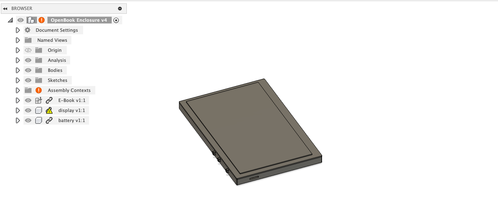
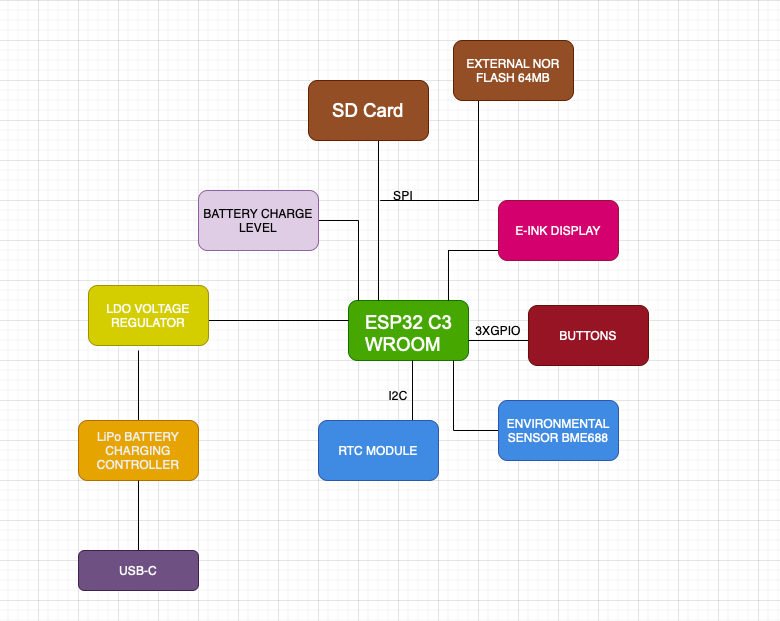

Dascalu Stefan-Nicolae 331CA
# Proiect-TSC
## Implementare:

- **Implementarea Schemei Electrice:**
  - Am implementat schema electrica exact conform modelului primit.
  - Am efectuat o **verificare a regulilor electrice (ERC)**; desi am intampinat cateva avertismente, le-am revizuit si considerat necritice.

- **Designul PCB:**
  - Dupa finalizarea schemei, am incarcat designul in mediul PCB.
  - Toate componentele au fost amplasate pe **TOP layer** conform ghidurilor de layout.
  - Pentru a asigura **proper grounding** si **signal integrity**, am creat un **GND plane** atat pe TOP layer, cat si pe BOTTOM layer.
  - Am verificat toate constrangerile de design, iar rutarea a fost finalizata cu o rata de succes de 99,6%.
  - In timpul designului PCB, am intampinat si rezolvat erori de tip "airwire unrouted".

- **Fisiere de Productie:**
  - Am generat fisierele **Gerber**, **Pick and Place** si **BOM**.

- **Modelul 3D:**
  - Modelul 3D al dispozitivului a fost implementat.

## Imagine 3D

## Diagrama bloc a proiectului:

## Descriere Hardware si Asignarea Pinilor pe ESP32-C6

- **ESP32-C6-WROOM-1-N8 (Microcontroler Principal)**
  - Microcontrolerul ofera suport pentru WiFi 6, Bluetooth 5 LE si dispune de un nucleu RISC-V ce functioneaza pana la 160 MHz.
  - Interfetele disponibile includ SPI, I2C, UART si GPIO, fiind baza pentru conectarea celorlalte module.

- **BME688 (Senzor Ambiental)**
  - Maseaza temperatura, umiditatea, presiunea atmosferica si calitatea aerului.
  - Interfata: I2C
  - Pini utilizati: SDA -> IO21, SCL -> IO22
  - Alegerea acestor pini se face pentru a beneficia de o comunicatie I2C rapida si fiabila.

- **DS3231SN (Real-Time Clock)**
  - Asigura cronometrare de inalta precizie, chiar si in lipsa alimentarii principale.
  - Interfata: I2C (se partajeaza cu BME688)
  - Pini utilizati: SCL -> IO22, SDA -> IO21, INT_RTC -> IO8, 32KHZ -> IO1, RTC_RST -> IO18
  - Acesti pini asigura functii suplimentare de intrerupere si reset pentru modulul RTC.

- **Afisaj E-Ink (7.5 inch)**
  - Afisajul ofera o rezolutie de 800 x 480 pixeli si functioneaza prin interfata SPI.
  - Pini utilizati: EPD_CS -> IO10, EPD_DC -> IO5, EPD_RST -> IO23, EPD_BUSY -> IO3 (EPD_BUSY este partajat cu MISO)
  - Linile MOSI si SCK sunt partajate cu modulul SD, permitand optimizarea numarului de pini utilizati.

- **Modul SD Card**
  - Permite stocarea locala a datelor, cum ar fi e-bookurile sau firmware-ul.
  - Interfata: SPI
  - Pini utilizati: SS_SD -> IO4, MOSI -> IO7, MISO -> IO2, SCK -> IO6
  - Aceste asignari asigura sincronizarea corecta a datelor pe interfata SPI.

- **Memorie Externa Flash (W25Q512JVEIQ, 64MB)**
  - Memoria flash externa este utilizata pentru stocarea firmware-ului si a datelor importante.
  - Interfata: SPI
  - Pini utilizati: FLASH_CS -> IO12 (MOSI, MISO si SCK sunt partajate cu modulul SD)
  
- **Interfata USB/SD**
  - Asigura alimentarea si transferul de date prin USB.
  - Pini utilizati: USB_D+ -> IO13, USB_D- -> IO12

- **Butoane Boot si Reset**
  - Permit accesul la modul boot si efectuarea unui reset hardware.
  - Pini utilizati: IO/BOOT -> IO9, RESET -> un pin dedicat (conform schemei)

- **Sistem de Alimentare si Management**
  - Bateria Li-Po (3.7V, 2500mAh) alimenteaza sistemul.
  - Controlerul de incarcare MCP73831 gestioneaza incarcarea prin USB-C.
  - Monitorizarea bateriei se realizeaza cu MAX17048, care comunica prin I2C (reutilizand SDA/IO21 si SCL/IO22).
  - Regulatorul LDO XC6220A331MR-G furnizeaza 3.3V stabile pentru toate modulele.
  
- **Conector USB-C**
  - Principalul conector pentru alimentare si transfer de date, protejat de circuit ESD.

- **Conector Qwiic/Stemma QT**
  - Permite extinderea usoara a sistemului cu module suplimentare I2C.
  - Utilizeaza acelasi bus I2C (SDA -> IO21, SCL -> IO22) ca si senzorii si modulul RTC.

## BOM:
| Component                                               | Link             |
|---------------------------------------------------------|------------------|
| ADAFRUIT_LEDCHIP-LED0603                                  | [Click here](https://www.snapeda.com/parts/KP-1608SURCK/Kingbright/view-part/?ref=search&t=LED%200603)   |
| SJ                                                      | [Click here](https://grabcad.com/library/solder-jumpers-1)   |
| 112ATAARR03                       | [Click here](https://www.snapeda.com/parts/112A-TAAR-R03/Attend/view-part/)   |
| RCL_CPOL-EUCT3528                                       | [Click here](https://grabcad.com/library/tantalum-smd-capacitor-type-b-3528-1)   |
| BUTTON_CUSYOMV1                                         | [Click here](https://www.snapeda.com/search/?q=EVQP7L01P&search-type=parts)   |
| DS3231SN#                                              | [Click here](https://www.snapeda.com/parts/DS3231SN%23/Analog%20Devices/view-part/?ref=search&t=DS3231SN%23)   |
| ESP32-C6-WROOM-1-N8                                     | [Click here](https://www.snapeda.com/parts/ESP32-C6-WROOM-1-N8/Espressif%20Systems/view-part/?ref=search&t=ESP32-C6-WROOM-1-N8)   |
| 744043680                                 | [Click here](https://eu.mouser.com/ProductDetail/Wurth-Elektronik/744043680?qs=PGXP4M47uW6VkZq%252BkzjrHA%3D%3D)   |
| BD5229G-TR                                  | [Click here](https://www.snapeda.com/parts/BD5229G-TR/Rohm/view-part/?ref=search&t=BD5229G-TR)   |
| ESP32_WROVER_BME680_BME680                               | [Click here](https://www.snapeda.com/parts/BME680/Bosch%20Sensortec/view-part/?ref=search&t=bme680)   |
| ESP32_WROVER_EAGLE-LTSPICE_R                              | [Click here](https://componentsearchengine.com/part-view/R0402%201%25%20100%20K%20(RC0402FR-07100KL)/YAGEO)   |
| ESP32_WROVER_SPARKFUN-DISCRETESEMI_MOSFET_PCH                                | [Click here](https://componentsearchengine.com/part-view/DMG2305UX-7/Diodes%20Incorporated)   |
| ESP32_WROVER_SPARKFUN-IC-POWER_MCP73831                              | [Click here](https://componentsearchengine.com/part-view/MCP73831T-2ACI%2FOT/Microchip)   |
| FH34SRJ-24S-0.5SH_99_                                 | [Click here](https://componentsearchengine.com/part-view/FH34SRJ-24S-0.5SH(99)/Hirose)   |
| TP                                 | - |
| SI1308EDL-T1-GE3                                  | [Click here](https://www.snapeda.com/parts/SI1308EDL-T1-GE3/Vishay/view-part/)   |
| ESP32_WROVER_AVX---SD0805S020S1R0_AVX_SD0805S020S1R0_0_0  | [Click here](https://componentsearchengine.com/part-view/SD0805S020S1R0/Kyocera%20AVX)   |
| CPH3225A                                               | [Click here](https://www.snapeda.com/parts/CPH3225A/Seiko/view-part/)   |
| MAX17048G+T10                                          | [Click here](https://www.snapeda.com/parts/MAX17048G+T10/Analog%20Devices/view-part/)   |
| MBR0530                                               | [Click here](https://www.snapeda.com/parts/MBR0530/Onsemi/view-part/)   |
| PGB1010603MR                                           | [Click here](https://www.snapeda.com/parts/PGB1010603MR/Littelfuse/view-part/)   |
| QWIIC_RIGHT_ANGLE (QWIIC_CONNECTORJS-1MM)               | [Click here](https://www.snapeda.com/parts/PRT-14417/SparkFun/view-part/)   |
| SAMACSYS_PARTS_USB4110-GF-A                              | [Click here](https://www.snapeda.com/parts/USB4110-GF-A./Global%20Connector%20Technology/view-part/)   |
| USBLC6-2SC6Y                                           | [Click here](https://www.snapeda.com/parts/USBLC6-2SC6Y/STMicroelectronics/view-part/?ref=dk&t=USBLC6-2SC6Y&con_ref=None)   |
| W25Q512JVEIQ                                           | [Click here](https://www.snapeda.com/parts/W25Q512JVEIQ/Winbond%20Electronics/view-part/?ref=search&t=W25Q512JVEIQ)   |
| XC6220A331MR-G                                         | [Click here](https://ro.mouser.com/ProductDetail/Torex-Semiconductor/XC6220A331MR-G?qs=AsjdqWjXhJ8ZSWznL1J0gg%3D%3D&utm_source=octopart&utm_medium=aggregator&utm_campaign=865-XC6220A331MR-G&utm_content=Torex%20Semiconductor)   |

